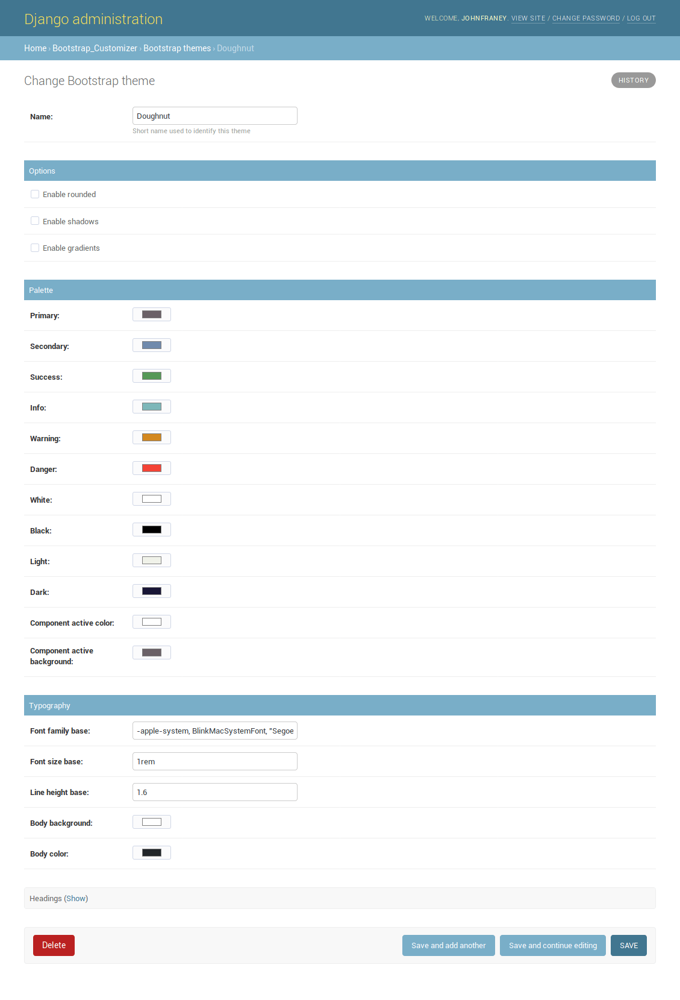

## About

Django Bootstrap Customizer lets you build a custom Bootstrap theme by creating `BootstrapTheme` models from the Django admin.

`BootstrapTheme` values are converted to Bootstrap SCSS variables that are used to compile customized Bootstrap CSS when you save your theme, using [`libsass-python`](https://github.com/sass/libsass-python) under the hood.

Enjoy tailored Bootstrap CSS without having to set up a Node front-end assets pipeline!


## Features

* Bootstrap 4.
* Generates optimized above-the-fold and below-the-fold CSS payloads, perfect for improving your site's [Google PageSpeed](https://developers.google.com/speed/pagespeed/insights/) score.
* Customized Bootstrap themes for each site in a [multi-site](https://docs.djangoproject.com/en/dev/ref/contrib/sites/#module-django.contrib.sites) installation.
* No Node/NPM/Gulp/Webpack required.


## Pages

- [Models](models.md)
- [Template Tags](template_tags.md)
- [Views](views.md)
- [Middleware](middleware.md)
- [Advanced Usage](advanced_usage.md)
- [FAQ](faq.md)


## Quickstart

Install Django Bootstrap Customizer:

```console
pip install django-bootstrap-customizer
```

Update settings:

```python
INSTALLED_APPS = (
    ...
    'django.contrib.sites',
    'bootstrap_customizer',
    ...
)

MIDDLEWARE = (
    ...
    'django.contrib.sites.middleware.CurrentSiteMiddleware',
    'bootstrap_customizer.middleware.BootstrapThemeMiddleware',
    ...
)

SITE_ID = 1
```

Run migrations:

```console
./manage.py migrate bootstrap_customizer
```

Add URL patterns:

```python
from bootstrap_customizer import urls as bootstrap_customizer_urls


urlpatterns = [
    ...
    path('bootstrap_customizer/', include(bootstrap_customizer_urls)),
    ...
]
```

Create a [`BootstrapTheme`](models.md#bootstraptheme) and [`SiteBootstrapTheme`](models.md#sitebootstraptheme) from the Django admin.

Add above-the-fold and below-the-fold CSS to your template:

```html+django
<!doctype html>
<html lang="en">
<head>
  <meta charset="UTF-8">
  <meta name="viewport" content="width=device-width, initial-scale=1, shrink-to-fit=no">
  <!-- Your head content -->
  <style lang="css"></style>
</head>
<body>
  <!-- Your body content -->
  <link rel="stylesheet" type="text/css" href="">
</body>
</html>
```

## Screenshot


